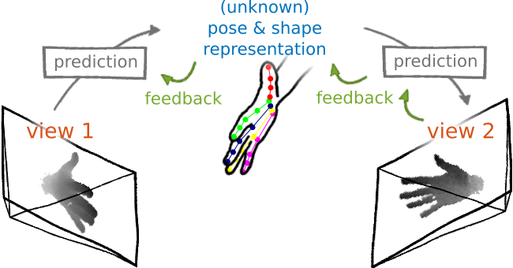

# Learning Pose Specific Representations by Predicting Different Views
This repository contains the code for the semi-supervised method we proposed in:  

[**Learning Pose Specific Representations by Predicting Different Views**](https://arxiv.org/abs/1804.03390)  
Georg Poier, David Schinagl and Horst Bischof.  
In *Proc. CVPR* (to be published), 2018. ([Project Page](https://poier.github.io/PreView/)).

---

  
We learn to predict a low-dimensional latent representation and, subsequently,
a different view of the input, 
*solely* from the latent representation.
The error of the view prediction is used as feedback,
enforcing the latent representation to capture pose specific information
without requiring labeled data.


## Usage
1. Download dataset
2. Adapt paths in configuration to point to the dataset
3. Run code

### Download dataset
We provide data-loaders for two datasets: 
(i) the NYU dataset [[1]](https://cims.nyu.edu/~tompson/NYU_Hand_Pose_Dataset.htm), and 
(ii) the MV-hands dataset [[2]](https://files.icg.tugraz.at/f/a190309bd4474ec2b13f/) 
published together with the paper.

### Adapt configuration 
You need to change the respective paths in `config/config_data_nyu.py` for the NYU dataset, 
or `config/config_data_icg.py` for the MV-hands/ICG dataset, resp.
For the MV-hands data you also need to change to the corresponding configuration 
by uncommenting the following line in `main_run.py`:

```python
from config.config_data_icg import args_data
```

### Run code

    python main_run.py

It will log the training and validation error using crayon 
(see [https://github.com/torrvision/crayon](https://github.com/torrvision/crayon)),
and output intermediate images and final results in the `results` folder.
When using the MV-hands dataset you need to change the camera view, which 
is to be predicted, by adding `--output-cam-ids-train 2` to the call.
To change further settings you can adapt the respective configuration files 
in the `config` folder or via the command-line 
(see `python main_run.py --help` for details). 
The default settings should be fine 
to reproduce the results from the paper, however.

#### Train with adversarial loss
For training with the additional adversarial loss just change the training type
using the corresponding command-line parameter. 
That is, call `python main_run.py --training-type 2` instead.
However, note that with this additional loss we merely obtained similar results 
for the cost of additional training time (see the paper for details).

#### Use pre-trained model
In `./source/results` you find a model pre-trained on the NYU dataset.
You can generate results using this one by calling:

    python main_run.py --model-filepath </path/to/model.mdl> --no-train


## Requirements
We used Python 2.7.
To run the code you can, e.g., install the following requirements:

 * [PyTorch](http://pytorch.org/) (0.3.1; torch, torchvision)
 * enum34
 * matplotlib
 * scipy
 * pycrayon


## Citation
If you can make use of this work, please cite:

Learning Pose Specific Representations by Predicting Different Views.  
Georg Poier, David Schinagl and Horst Bischof.  
In *Proc. CVPR* (to be published), 2018.

Bibtex:
```
@inproceedings{Poier2018cvpr_preview,  
  author = {Georg Poier and David Schinagl and Horst Bischof},  
  title = {Learning Pose Specific Representations by Predicting Different Views},  
  booktitle = {{Proc. IEEE/CVF Conf. on Computer Vision and Pattern Recognition (CVPR)}},  
  note = {(to be published)},  
  year = {2018}
}
```

## References
\[1] [https://cims.nyu.edu/~tompson/NYU\_Hand\_Pose\_Dataset.htm](https://cims.nyu.edu/~tompson/NYU_Hand_Pose_Dataset.htm)  
\[2] [https://files.icg.tugraz.at/f/a190309bd4474ec2b13f/](https://files.icg.tugraz.at/f/a190309bd4474ec2b13f/)  

